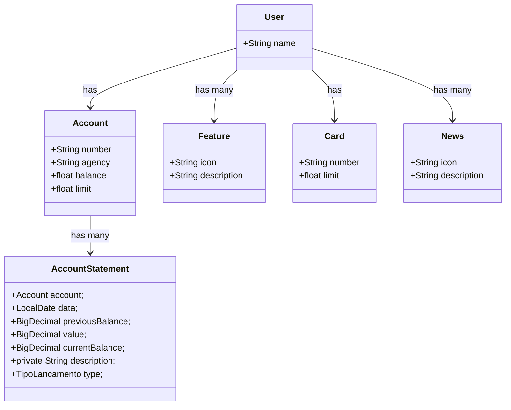

# Santander bootcamp 2024
Java Restful API desenvovida no Santander Bootcamp 2024

# Principais Tecnologias
 - **Java 17**: Utilizaremos a versão LTS mais recente do Java para tirar vantagem das últimas inovações que essa linguagem robusta e amplamente utilizada oferece;
 - **Spring Boot 3**: Trabalharemos com a mais nova versão do Spring Boot, que maximiza a produtividade do desenvolvedor por meio de sua poderosa premissa de autoconfiguração;
 - **Spring Data JPA**: Exploraremos como essa ferramenta pode simplificar nossa camada de acesso aos dados, facilitando a integração com bancos de dados SQL;
 - **OpenAPI (Swagger)**: Vamos criar uma documentação de API eficaz e fácil de entender usando a OpenAPI (Swagger), perfeitamente alinhada com a alta produtividade que o Spring Boot oferece;
 - **Railway**: facilita o deploy e monitoramento de nossas soluções na nuvem, além de oferecer diversos bancos de dados como serviço e pipelines de CI/CD.

## Diagrama de Classes

# Documentação da API (Swagger)

### [https://santander-bootcamp-2024-production-9e22.up.railway.app/swagger-ui/index.html)

# Sobre o projeto 

1 - Na primeira etapa acompanhei o tutorial do curso e repliquei aquilo que foi desenvolvido no curso como mostra a imagem abaixo:

## Observações
### Rodar com profile de produção
java -jar -Dspring.profiles.active=prod target\bootcamp-2024-0.0.1-SNAPSHOT.jar

### Rodar com profile de Desenvolvimento
java -jar -Dspring.profiles.active=dev target\bootcamp-2024-0.0.1-SNAPSHOT.jar

