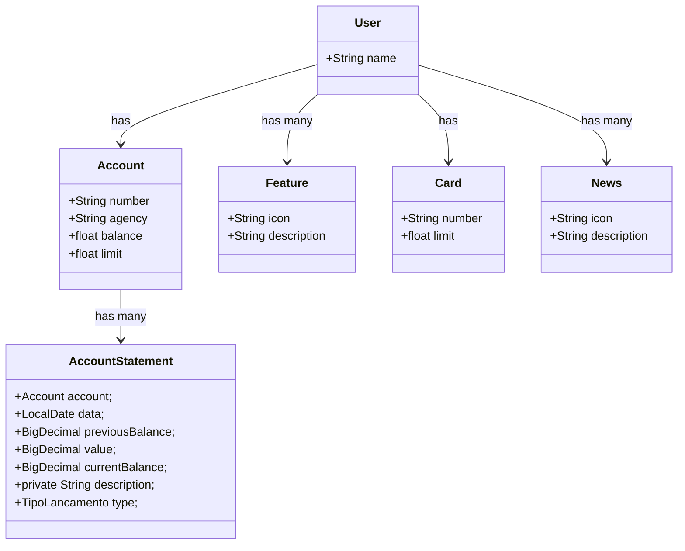

# Santander bootcamp 2024
Java Restful API desenvovida no Santander Bootcamp 2024

# Principais Tecnologias
 - **Java 17**: Utilizaremos a versão LTS mais recente do Java para tirar vantagem das últimas inovações que essa linguagem robusta e amplamente utilizada oferece;
 - **Spring Boot 3**: Trabalharemos com a mais nova versão do Spring Boot, que maximiza a produtividade do desenvolvedor por meio de sua poderosa premissa de autoconfiguração;
 - **Spring Data JPA**: Exploraremos como essa ferramenta pode simplificar nossa camada de acesso aos dados, facilitando a integração com bancos de dados SQL;
 - **OpenAPI (Swagger)**: Vamos criar uma documentação de API eficaz e fácil de entender usando a OpenAPI (Swagger), perfeitamente alinhada com a alta produtividade que o Spring Boot oferece;
 - **Railway**: facilita o deploy e monitoramento de nossas soluções na nuvem, além de oferecer diversos bancos de dados como serviço e pipelines de CI/CD.

## Diagrama de Classes




# Documentação da API (Swagger)

### [https://santander-bootcamp-2024-production-9e22.up.railway.app/swagger-ui/index.html)


# Sobre o projeto 

1 - Na primeira etapa acompanhei o tutorial do curso e repliquei aquilo que foi desenvolvido no curso como mostra a imagem abaixo:


2 - Na segunda parte desenvolvi a parte de iteração com as contas adicionando funcionalidades para consultar as contas, fazer operações de débito, crédito e transferência, 
    como mostra a imagem abaixo:

	
3 - Na Terceira e ultima parte desnvolvi um endpoint para consultar uma conta e o histórico dos seus lançamentos como mostra a imagem abaixo:


# Validando o projeto
1 - Para validar a solução cadastrei dois usuarios através do método POST em "/users".


2 - Depois fiz lançamentos de Débito, Crédito e transferência para cada um dos dois usuários através do método POST nos seguintes endpoints:

  A) /accounts/credit
  
  B) /accounts/debit
  
  C) /accounts/transfer 

  
3- Por fim podemos ver o resultado final com o histórico dos lançamentos executando o método GET no endpoint /history/{number}/{dataini}  

   A) Consulta na conta do primeiro Usuario:
   ```javascript
   {
  "account": {
    "id": 1,
    "number": "1",
    "agency": "1",
    "balance": 4446,
    "limit": 0
  },
  "history": [
    {
      "id": 1,
      "accountNumber": "1",
      "data": "2024-07-09",
      "previousBalance": 0,
      "value": 5000,
      "currentBalance": 5000,
      "description": "Credit of slary",
      "type": "CREDIT"
    },
    {
      "id": 3,
      "accountNumber": "1",
      "data": "2024-07-09",
      "previousBalance": 5000,
      "value": 254,
      "currentBalance": 4746,
      "description": "Gasoline ",
      "type": "DEBIT"
    },
    {
      "id": 5,
      "accountNumber": "1",
      "data": "2024-07-09",
      "previousBalance": 4746,
      "value": 300,
      "currentBalance": 4446,
      "description": "Transfer to account: 2",
      "type": "DEBIT"
    }
  ]
}
   ```
   
   B) Consulta na conta do segundo Usuario:
   
   ```javascript
   {
  "account": {
    "id": 2,
    "number": "2",
    "agency": "1",
    "balance": 3102,
    "limit": 0
  },
  "history": [
    {
      "id": 2,
      "accountNumber": "2",
      "data": "2024-07-09",
      "previousBalance": 0,
      "value": 3000,
      "currentBalance": 3000,
      "description": "Credit of slary",
      "type": "CREDIT"
    },
    {
      "id": 4,
      "accountNumber": "2",
      "data": "2024-07-09",
      "previousBalance": 3000,
      "value": 198,
      "currentBalance": 2802,
      "description": "Clothes",
      "type": "DEBIT"
    },
    {
      "id": 6,
      "accountNumber": "2",
      "data": "2024-07-09",
      "previousBalance": 2802,
      "value": 300,
      "currentBalance": 3102,
      "description": "Transfer from account: 1",
      "type": "CREDIT"
    }
  ]
}
   ```
   

## Observações
### Rodar com profile de produção
java -jar -Dspring.profiles.active=prod target\bootcamp-2024-0.0.1-SNAPSHOT.jar

### Rodar com profile de Desenvolvimento
java -jar -Dspring.profiles.active=dev target\bootcamp-2024-0.0.1-SNAPSHOT.jar

